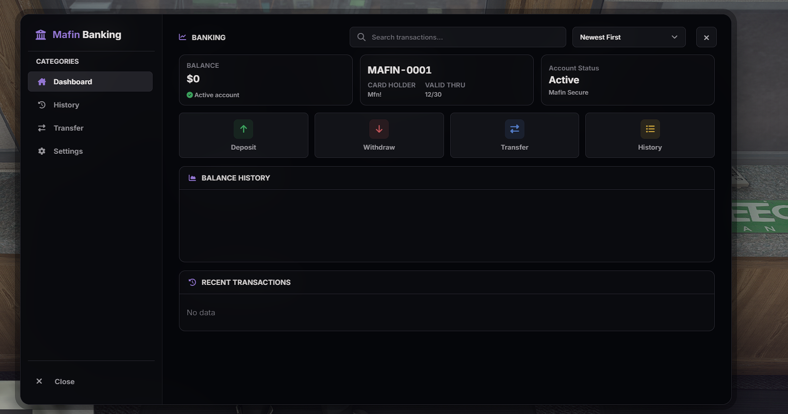
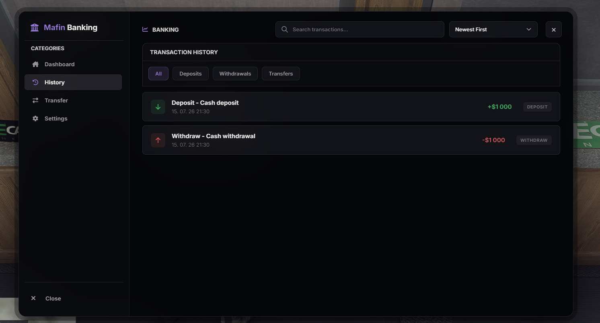
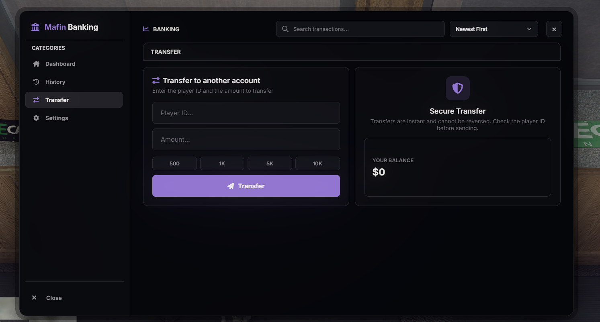
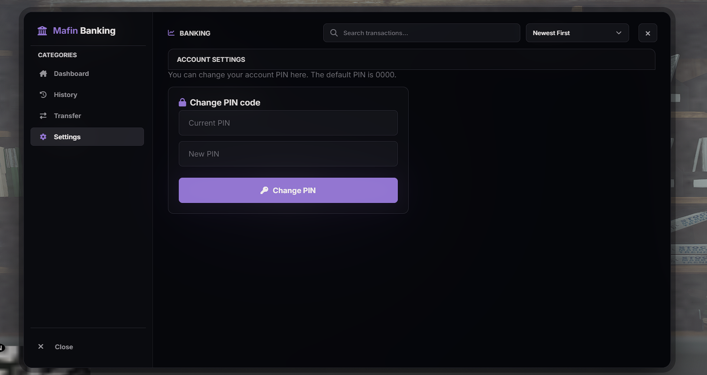

# Mafin Banking

Mafin Banking - personal and society banking UI for ESX servers.

## GitHub Description

Modern FiveM ESX banking resource with a dealership-inspired dark NUI, account dashboard, transaction history, transfers, PIN settings, ATM support, and preview screenshots.

## Preview

### Dashboard

### Transaction History

### Transfer

### Settings

## Installation

1. Place the `mafin_banking` folder inside your FiveM resources directory.
2. Import any SQL files listed below, if present.
3. Add `ensure mafin_banking` to your `server.cfg`.
4. Start or restart your server.

## Database

Import these SQL file(s) before starting the resource:

- `mafin_banking.sql`

## Resource Name

Use `mafin_banking` for exports, NUI callbacks, and server.cfg entries.

